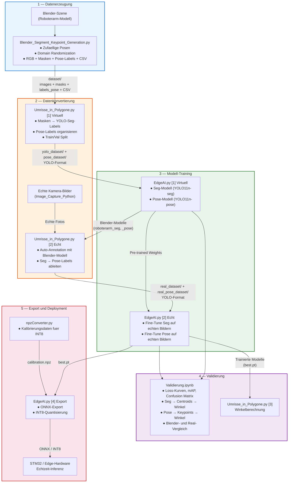
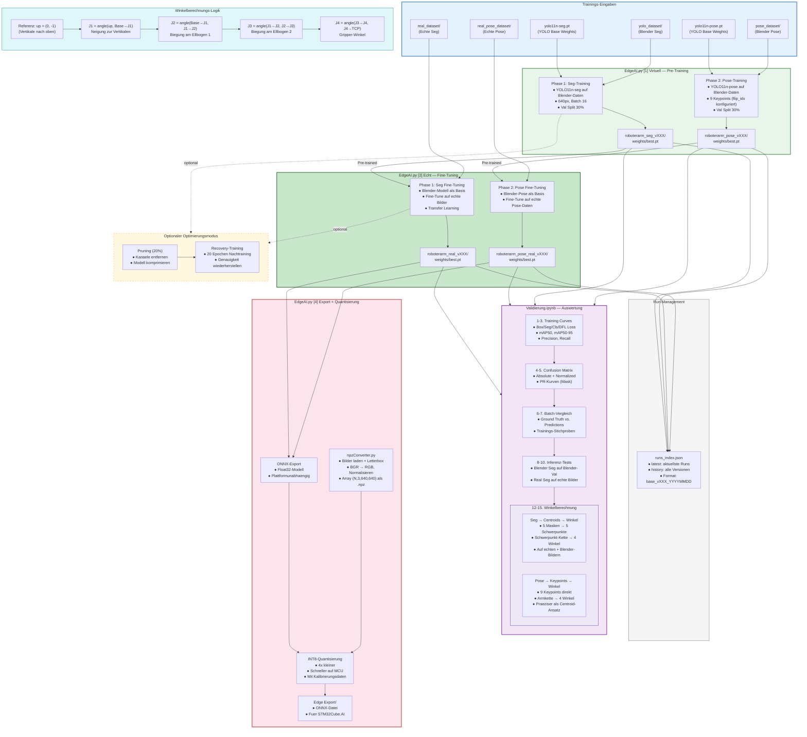

# KI-Pipeline Flussdiagramme — Roboterarm Pose Estimation

## 1. High-Level: Gesamte KI-Pipeline

Dieses Diagramm zeigt den gesamten Ablauf von der synthetischen Datengenerierung bis zur Echtzeit-Inferenz auf einem Mikrocontroller.



### Zusammenfassung der Phasen

| Phase | Skript | Eingabe | Ausgabe |
|-------|--------|---------|---------|
| **1. Datenerzeugung** | `Blender_Segment_Keypoint_Generation.py` | Blender-Szene | RGB, Masken, Pose-Labels, CSV |
| **2a. Konvertierung (Virtuell)** | `Umrisse_in_Polygone.py [1]` | Blender-Dataset | YOLO-Seg + Pose Datasets |
| **2b. Konvertierung (Echt)** | `Umrisse_in_Polygone.py [2]` | Kamera-Bilder + Blender-Modell | YOLO-Seg + Pose Datasets (Real) |
| **3a. Training (Virtuell)** | `EdgeAI.py [1]` | YOLO-Datasets | Blender-Modelle (best.pt) |
| **3b. Training (Echt)** | `EdgeAI.py [2]` | Real-Datasets + Pre-trained | Real-Modelle (best.pt) |
| **4. Validierung** | `Validierung.ipynb` | Trainierte Modelle | Metriken, Winkelvergleich |
| **5. Export** | `EdgeAI.py [4]` + `npzConverter.py` | best.pt + Kalibrierbilder | ONNX + INT8 |

---

## 2. Detail-Diagramm: Datengenerierung und Konvertierung

Detaillierter Ablauf innerhalb der Blender-Datengenerierung (mit Domain Randomization) und der anschliessenden Konvertierung in YOLO-Trainingsformat.

```mermaid
flowchart TB
    subgraph BLENDER_INIT["Initialisierung (einmalig)"]
        SCENE["Blender-Szene laden<br/>(Roboterarm + Kamera + Licht)"]
        CALIB["keypoint_axis_calibration.py<br/>● Marker platzieren<br/>● Offsets berechnen<br/>● KEYPOINT_SPECS erstellen"]
        SNAPSHOT["Snapshot erstellen<br/>● Kamera-Position/Rotation<br/>● Licht-Intensitaet/Farbe<br/>● World-Hintergrund<br/>● Belichtung"]
        DIRS["Output-Verzeichnisse erstellen<br/>images/ masks/ labels_pose/"]
        SCENE --> CALIB --> SNAPSHOT --> DIRS
    end

    subgraph LOOP["Hauptschleife (pro Sample i = 0 .. N)"]
        direction TB
        POSE["1. Zufaellige Roboter-Pose<br/>● Gelenkwinkel randomisieren<br/>● Armature Bones rotieren"]

        subgraph DR["2. Domain Randomization"]
            DR_CAM["Kamera<br/>± 3cm Position<br/>± 2° Rotation"]
            DR_LIGHT["Beleuchtung<br/>0.4x - 2.5x Intensitaet<br/>± 0.15 Farbverschiebung"]
            DR_BG["Hintergrund<br/>Zufaellige Farbe<br/>0.01 - 0.25 Helligkeit"]
            DR_EXP["Belichtung<br/>-2.0 bis +1.5 EV"]
        end

        RENDER_RGB["3. RGB-Render (EEVEE)<br/>640x640 PNG"]
        NOISE["4. Post-Render Noise (numpy)<br/>Gauss σ = 0.0 - 0.12<br/>Auf RGB anwenden"]

        RESET_EXP["5. Belichtung zuruecksetzen<br/>exposure = 0.0"]

        RENDER_MASK["6. Masken-Render (Workbench)<br/>Farbkodiert, sauber<br/>OHNE Augmentierung"]

        LABELS["7. Labels generieren<br/>● YOLO-Pose-Label (.txt)<br/>  9 Keypoints + BBox<br/>● CSV-Zeile (Gelenkwinkel)"]

        RESTORE["8. Restore<br/>Kamera, Licht, World, Exposure"]

        POSE --> DR
        DR --> RENDER_RGB --> NOISE --> RESET_EXP --> RENDER_MASK --> LABELS --> RESTORE
    end

    subgraph OUTPUT_RAW["Blender-Output (dataset/)"]
        OUT_IMG["images/<br/>image_0000.png .. image_N.png<br/>(RGB + Noise + Domain Rand.)"]
        OUT_MASK["masks/<br/>mask_0000.png .. mask_N.png<br/>(Saubere Farbmasken)"]
        OUT_POSE["labels_pose/<br/>image_0000.txt .. image_N.txt<br/>(YOLO-Pose 9 KP)"]
        OUT_CSV["joint_data.csv<br/>(Gelenkwinkel Ground Truth)"]
    end

    subgraph KONV_VIRTUELL["Umrisse_in_Polygone.py [1] Virtuell"]
        MASK_HSV["Masken → HSV-Analyse<br/>● Farbkodierung:<br/>  Rot=Base, Gruen=J1<br/>  Blau=J2, Gelb=J3<br/>  Magenta=J4"]
        CONTOUR["Konturen extrahieren<br/>● cv2.findContours()<br/>● Polygon-Koordinaten"]
        YOLO_LABEL["YOLO-Seg-Labels schreiben<br/>● Klasse + normalisierte Polygone<br/>● Format: cls x1 y1 x2 y2 ..."]
        SPLIT["Train/Val Split (70/30)<br/>● Bilder kopieren<br/>● Labels kopieren<br/>● YAML-Konfig erstellen"]

        MASK_HSV --> CONTOUR --> YOLO_LABEL --> SPLIT
    end

    subgraph OUTPUT_YOLO["YOLO-Trainingsformat"]
        YOLO_SEG["yolo_dataset/<br/>├ images/train + val/<br/>├ labels/train + val/<br/>└ dataset.yaml"]
        YOLO_POSE["pose_dataset/<br/>├ images/train + val/<br/>├ labels/train + val/<br/>└ pose_dataset.yaml"]
    end

    subgraph KONV_REAL["Umrisse_in_Polygone.py [2] Echt"]
        REAL_IMG["Echte Kamera-Bilder<br/>(Image_Capture_Python)"]
        AUTO_SEG["Auto-Annotation<br/>● Blender-Seg-Modell laden<br/>● Inferenz auf echte Bilder<br/>● Masken → YOLO-Seg-Labels"]
        SEG2POSE["Seg → Pose ableiten<br/>● Centroids berechnen<br/>● Keypoint-Labels generieren"]
        SPLIT_R["Train/Val Split<br/>● real_dataset/ + real_pose_dataset/<br/>● YAML-Konfigs"]

        REAL_IMG --> AUTO_SEG --> SEG2POSE --> SPLIT_R
    end

    subgraph OUTPUT_REAL["YOLO Real-Format"]
        REAL_SEG["real_dataset/<br/>├ images/all/<br/>└ labels/all/"]
        REAL_POSE_DS["real_pose_dataset/<br/>├ images/train + val/<br/>├ labels/train + val/<br/>└ real_pose_dataset.yaml"]
    end

    %% Verbindungen
    DIRS --> LOOP
    LOOP --> OUT_IMG & OUT_MASK & OUT_POSE & OUT_CSV
    OUT_MASK --> MASK_HSV
    OUT_IMG --> SPLIT
    OUT_POSE --> SPLIT
    SPLIT --> YOLO_SEG & YOLO_POSE
    SPLIT_R --> REAL_SEG & REAL_POSE_DS

    %% Styling
    style BLENDER_INIT fill:#e3f2fd,stroke:#1565c0,stroke-width:2px
    style LOOP fill:#e8f5e9,stroke:#2e7d32,stroke-width:2px
    style DR fill:#fff8e1,stroke:#f9a825,stroke-width:1px
    style OUTPUT_RAW fill:#f3e5f5,stroke:#7b1fa2,stroke-width:2px
    style KONV_VIRTUELL fill:#fff3e0,stroke:#e65100,stroke-width:2px
    style OUTPUT_YOLO fill:#e8f5e9,stroke:#2e7d32,stroke-width:2px
    style KONV_REAL fill:#fce4ec,stroke:#c62828,stroke-width:2px
    style OUTPUT_REAL fill:#e8f5e9,stroke:#2e7d32,stroke-width:2px
```



### Farbkodierung der Segmentierungsmasken

| Klasse | Farbe | HSV-Bereich (H) | Roboterteil |
|--------|-------|------------------|-------------|
| 0 | Rot | 0-10 / 170-179 | Base |
| 1 | Gruen | 40-85 | Joint 1 |
| 2 | Blau | 90-135 | Joint 2 |
| 3 | Gelb | 20-35 | Joint 3 |
| 4 | Magenta | 140-165 | Joint 4 (Finger) |

### Domain Randomization Parameter

| Parameter | Bereich | Zweck |
|-----------|---------|-------|
| Kamera Position | ± 3 cm | Leichte Perspektivverschiebung |
| Kamera Rotation | ± 2° | Kippvariation |
| Licht Intensitaet | 0.4x - 2.5x | Helle/dunkle Szenen |
| Licht Farbe | ± 0.15 RGB | Farbtemperatur-Variation |
| Hintergrund | 0.01 - 0.25 | Dunkle bis helle Hintergruende |
| Belichtung | -2.0 bis +1.5 EV | Unter-/Ueberbelichtung |
| Gauss-Noise | σ 0.0 - 0.12 | Kamerarauschen simulieren |

---

## 3. Detail-Diagramm: Training, Validierung und Export

Detaillierter Ablauf des YOLO-Trainings in beiden Modi (Virtuell/Echt), der Validierung und des Exports fuer Edge-Deployment.



### Modell-Versionen und Runs

Das Run-Management in `EdgeAI.py` versioniert alle Trainingslaeufe automatisch:

```
Trained_Models/AI-Models/
├── roboterarm_seg_v001_20260416/      ← Blender Seg (1. Lauf)
│   └── weights/best.pt
├── roboterarm_seg_v006_20260328/      ← Blender Seg (aktuellster)
│   └── weights/best.pt
├── roboterarm_pose_v006_20260328/     ← Blender Pose
│   └── weights/best.pt
├── roboterarm_real_v008_20260324/     ← Real Seg (Fine-Tuned)
│   └── weights/best.pt
├── roboterarm_pose_real_v006_20260324/← Real Pose (Fine-Tuned)
│   └── weights/best.pt
└── runs_index.json                    ← Index aller Laeufe
```

### Zwei Wege zur Winkelberechnung

| Methode | Quelle | Vorteile | Nachteile |
|---------|--------|----------|-----------|
| **Seg → Centroids** | Segmentierungsmasken | Robust, funktioniert mit weniger Trainingsdaten | Centroid-Position abhaengig von Maskenform |
| **Pose → Keypoints** | Pose-Keypoints direkt | Praeziser, direkte Gelenkpositionen | Benoetigt mehr Trainingsdaten, empfindlicher |

### Trainings-Parameter

| Parameter | Wert | Beschreibung |
|-----------|------|--------------|
| `IMG_SIZE` | 640 | Bildgroesse fuer Training und Inferenz |
| `BATCH_SIZE` | 16 | Batch-Groesse pro GPU |
| `VAL_SPLIT` | 0.3 | 30% Validierung, 70% Training |
| `SEED` | 42 | Reproduzierbarkeit |
| `PRUNE_RATIO` | 0.20 | Pruning: 20% der Kanaele (optional) |
| `PRUNE_RECOVERY_EPOCHS` | 20 | Recovery nach Pruning (optional) |
| `CALIBRATION_IMAGES` | 64 | Bilder fuer INT8-Kalibrierung |
