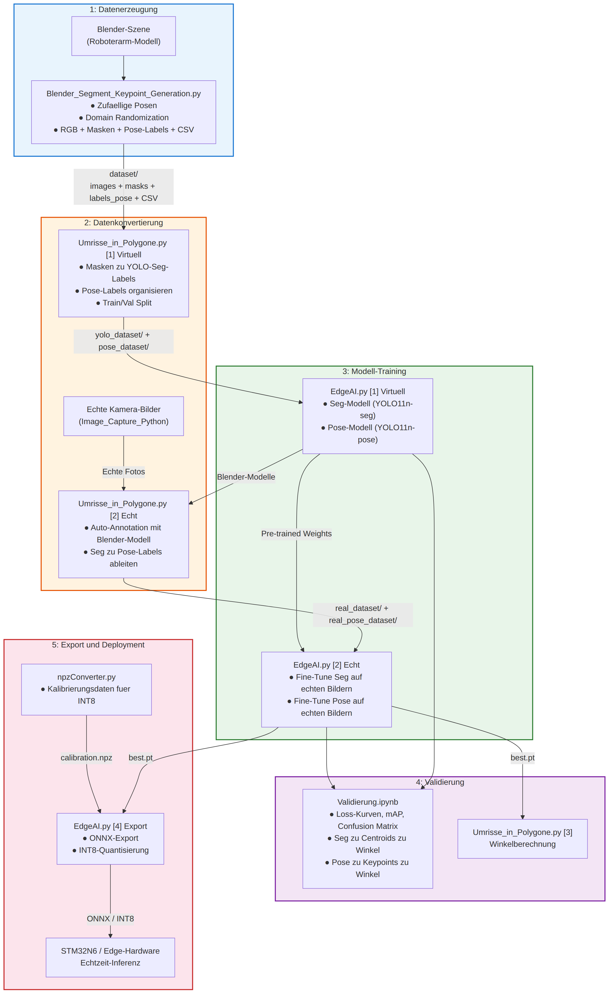

# Roboterarm Joint-Erkennung: KI-Dokumentation

Vollständige Dokumentation der KI-Pipeline: von der virtuellen Datenerzeugung in
Blender über das Training bis zum quantisierten ONNX-Modell für den STM32N6.

> [!IMPORTANT]
> Für das KI-Training wurde Blender verwenden           (https://www.blender.org/download/)

---

## Inhalt

- [Roboterarm Joint-Erkennung: KI-Dokumentation](#roboterarm-joint-erkennung-ki-dokumentation)
  - [Inhalt](#inhalt)
  - [1. Übersicht](#1-übersicht)
    - [Klassen](#klassen)
    - [Keypoint-Schema (9 Keypoints)](#keypoint-schema-9-keypoints)
  - [2. Schnellstart](#2-schnellstart)
  - [3. Projektstruktur](#3-projektstruktur)
  - [4. Die Pipeline im Überblick als Flussdiagramm](#4-die-pipeline-im-überblick-als-flussdiagramm)
  - [5. Die Skripte im Detail](#5-die-skripte-im-detail)
    - [5.1 Blender: Datenerzeugung](#51-blender-datenerzeugung)
      - [Randomisierungsparameter](#randomisierungsparameter)
    - [5.2 `Umrisse_in_Polygone.py`: Datenvorbereitung](#52-umrisse_in_polygonepy-datenvorbereitung)
      - [Schritt 1: Virtuell](#schritt-1-virtuell)
      - [Schritt 2: Echt](#schritt-2-echt)
      - [Die richtige Reihenfolge](#die-richtige-reihenfolge)
      - [Segmentierung gegenüber Pose bei echten Bildern](#segmentierung-gegenüber-pose-bei-echten-bildern)
      - [Schritt 3: Winkelberechnung](#schritt-3-winkelberechnung)
      - [Zwei Wege zur Winkelberechnung im Vergleich](#zwei-wege-zur-winkelberechnung-im-vergleich)
    - [5.3 `EdgeAI.py`: Training, Validierung, Export](#53-edgeaipy-training-validierung-export)
      - [Device-Auswahl](#device-auswahl)
      - [Aktuellen KI-Trainingsparameter](#aktuellen-ki-trainingsparameter)
      - [Standard gegenüber Optimiert](#standard-gegenüber-optimiert)
    - [5.4 `Validierung.ipynb`: Auswertung](#54-validierungipynb-auswertung)
    - [5.5 Label Studio: Labels prüfen und zurückspielen](#55-label-studio-labels-prüfen-und-zurückspielen)
      - [Hinweg: `label_studio_converter.py`](#hinweg-label_studio_converterpy)
      - [Bilder bereitstellen](#bilder-bereitstellen)
      - [Import in Label Studio](#import-in-label-studio)
      - [Rückweg: `label_studio_sync.py`](#rückweg-label_studio_syncpy)
    - [5.6 `npzConverter.py`: Kalibrierdaten für STM32Cube AI Studio](#56-npzconverterpy-kalibrierdaten-für-stm32cube-ai-studio)
      - [Warum Kalibrierung nötig ist](#warum-kalibrierung-nötig-ist)
      - [Kommandozeilenoptionen](#kommandozeilenoptionen)
      - [Beispiel](#beispiel)
  - [6. Pfad- und Run-Verwaltung](#6-pfad--und-run-verwaltung)
    - [Versionierte Runs](#versionierte-runs)
    - [Automatische Erkennung neuer Realbild-Daten](#automatische-erkennung-neuer-realbild-daten)
    - [Optionale Umgebungsvariablen](#optionale-umgebungsvariablen)
  - [7. Datensätze und Label-Formate](#7-datensätze-und-label-formate)
    - [YOLO-Segmentierungs-Label](#yolo-segmentierungs-label)
    - [YOLO-Pose-Label](#yolo-pose-label)
  - [8. Häufige Fehler](#8-häufige-fehler)
    - [Training (`EdgeAI.py`)](#training-edgeaipy)
    - [Datenvorbereitung (`Umrisse_in_Polygone.py`)](#datenvorbereitung-umrisse_in_polygonepy)
    - [Kalibrierdaten (`npzConverter.py`)](#kalibrierdaten-npzconverterpy)

---

## 1. Übersicht

Ziel ist die **Bestimmung der Gelenkwinkel eines Roboterarms aus einem einzelnen
Kamerabild**. Dafür werden die 5 Sektionen des Arms mit YOLO erkannt, entweder als
Segmentierungsmasken oder als Pose-Keypoints, und daraus die Winkel geometrisch
abgeleitet.

Das Training läuft in zwei Phasen:

1. **Pre-Training** auf virtuellen Blender-Daten.
2. **Fine-Tuning** auf echten Kamerabildern. Transfer in die reale Welt.

Die Verwendung von Blender hat den Vorteil, dass ohne den Roboter, sehr schnell viele 
unterschiedliche Trainingsdaten generiert werden können. 

### Klassen

| ID | Name | Farbe in der Blender-Maske |
|----|------|----------------------------|
| 0 | Base | Rot |
| 1 | Joint 1 | Grün |
| 2 | Joint 2 | Blau |
| 3 | Joint 3 | Gelb |
| 4 | Joint 4 / Finger | Magenta |

### Keypoint-Schema (9 Keypoints)

```python
KP_IDX = {
    "base":    0,   # Basis, Fuß des Arms
    "base_z1": 1,   # Z-Achsen-Referenzpunkt 1
    "base_z2": 2,   # Z-Achsen-Referenzpunkt 2
    "j1":      3,   # Joint 1, Rotation um die Z-Achse
    "j1_z1":   4,   # Z-Referenzpunkt für Joint 1
    "j2":      5,   # Joint 2
    "j3":      6,   # Joint 3
    "j4":      7,   # Joint 4, Gripper
    "tcp":     8,   # Tool Center Point
}
```

Die drei Z-Referenzpunkte (`base_z1`, `base_z2`, `j1_z1`) dienen der Bestimmung der
Rotation um die Z-Achse.

---

## 2. Schnellstart

> [!IMPORTANT]
> Bevor die Pipeline unten nacheinander ausgeführt werden kann, muss **zuerst Blender** ausgeführt werden

```bash
# --- Phase 1: Synthetische Daten ---------------------------------
#   Blender starten und folgende Skripte ausführen:
#   Segmentierung per Blender/keypoint_axis_calibration.py
#   Segmentierung per Blender/Blender_Segment_Keypoint_Generation.py

python Umrisse_in_Polygone.py 1     # Masken zu Labels, Train/Val Split
python EdgeAI.py 1                  # Seg + Pose auf Blender-Daten trainieren

# --- Phase 2: Echte Daten ----------------------------------------
# Bilder mit Image_Capture_Python/capture_image.py aufnehmen

python Umrisse_in_Polygone.py 2     # Auto-Annotation + Pose-Labels
```
> [!IMPORTANT]
> Danach die generierten Labels überprüfen in Label-Studio, siehe [Abschnitt 5.5](#55-label-studio-labels-prüfen-und-zurückspielen)

```bash
python EdgeAI.py 2                  # Fine-Tuning auf echten Bildern

# --- Phase 3: Auswerten und exportieren --------------------------
python Umrisse_in_Polygone.py 3     # Winkelberechnung + MAE
python EdgeAI.py 3                  # Formale Validierung
python EdgeAI.py 4 --quantize       # ONNX-Export mit INT8
python npzConverter.py --images <ordner> --out calibration.npz --imgsz 640 --norm_to_1
```

Alle Skripte lassen sich auch ohne Argument starten, dann erscheint ein Menü.

---

## 3. Projektstruktur

```
Nach dem erfolgreich das Modell trainiert wurde, wird dieser Projektordner die
folgende Ordnerstruktur aufweisen: 

Beachlor_Thesis_AI/
├── Training_Scripts/
│   ├── EdgeAI.py                     # Training, Validierung, Export
│   ├── Umrisse_in_Polygone.py        # Datenvorbereitung, Winkelberechnung
│   ├── npzConverter.py               # Kalibrierdaten für STM32Cube AI Studio
│   ├── label_studio_converter.py     # YOLO zu Label-Studio-Tasks
│   ├── label_studio_sync.py          # Label-Studio-Export zurück ins Dataset
│   ├── serve_with_cors.py            # lokaler Bildhost für Label Studio
│   ├── Validierung.ipynb             # Auswertung und Visualisierung
│   ├── Segmentierung per Blender/
│   │   ├── Blender_Segment_Keypoint_Generation.py
│   │   ├── keypoint_axis_calibration.py
│   │   ├── dataset/                  # images, masks, labels, labels_pose
│   │   ├── yolo_dataset/             # YOLO-Seg, train/val
│   │   ├── pose_dataset/             # YOLO-Pose, train/val
│   │   ├── dataset.yaml
│   │   └── pose_dataset.yaml
│   ├── real_dataset/                 # auto-annotierte echte Bilder, Seg
│   ├── real_pose_dataset/            # Pose-Labels für echte Bilder
│   ├── real_yolo_dataset/
│   ├── label_studio_import/          # erzeugte Task-JSONs und Label-Configs
│   └── winkel_output/                # Skeleton-Visualisierungen mit Winkeln
├── Trained_Models/
│   └── AI-Models/
│       ├── roboterarm_seg_*/         # Segmentierung, Blender
│       ├── roboterarm_pose_*/        # Pose, Blender
│       ├── roboterarm_real_*/        # Segmentierung, fine-getunt
│       ├── roboterarm_pose_real_*/   # Pose, fine-getunt
│       └── runs_index.json           # Index aller Läufe
├── Edge Export/                      # exportierte ONNX-Modelle
├── yolo11n-seg.pt                    # Basisgewichte YOLO11 Nano Seg
└── yolo11n-pose.pt                   # Basisgewichte YOLO11 Nano Pose
```

> [!IMPORTANT] 
> Datensätze, Modelle und Bilder sind über die `.gitignore`
> ausgeschlossen und liegen nicht im Repository. 

---

## 4. Die Pipeline im Überblick als Flussdiagramm



---

## 5. Die Skripte im Detail

### 5.1 Blender: Datenerzeugung

Zwei Skripte, beide werden **innerhalb von Blender** ausgeführt.

**`keypoint_axis_calibration.py`** wird einmalig ausgeführt. Im Viewport werden Marker
mit dem Namensschema `KP_CAL_MARKER_*` von Hand auf die gewünschten Referenzpunkte
gesetzt. Das Skript berechnet daraus die Offsets, erzeugt die `KEYPOINT_SPECS` und
rendert Kontroll-Previews nach `dataset/keypoint_calibration/`.

**`Blender_Segment_Keypoint_Generation.py`** erzeugt den Datensatz. Pro Sample läuft
folgende Schleife:

1. Zufällige Roboter-Pose
2. Domain Randomization anwenden (siehe Tabelle unten)
3. RGB-Render mit EEVEE, 640 x 640 PNG
4. Gauss-Rauschen per numpy auf das RGB-Bild
5. Belichtung zurücksetzen
6. Masken-Render mit Workbench, farbkodiert
7. Labels schreiben: YOLO-Pose-Label mit 9 Keypoints plus CSV-Zeile mit den Winkeln
8. Kamera, Licht, World und Belichtung wiederherstellen


#### Randomisierungsparameter

| Parameter | Bereich | Zweck |
|-----------|---------|-------|
| Kameraposition | ± 3 cm | leichte Perspektivverschiebung |
| Kamerarotation | ± 2° | Kippvariation |
| Lichtintensität | 0,4x bis 2,5x | helle und dunkle Szenen |
| Lichtfarbe | ± 0,15 RGB | Farbtemperaturvariation |
| Hintergrund | 0,01 bis 0,25 | dunkle bis helle Hintergründe |
| Belichtung | -2,0 bis +1,5 EV | Unter- und Überbelichtung |
| Gauss-Rauschen | σ 0,0 bis 0,12 | Kamerarauschen simulieren |

---

### 5.2 `Umrisse_in_Polygone.py`: Datenvorbereitung

Drei Menüpunkte, jeder bereitet Segment und Pose-Daten in einem Durchlauf auf.

```bash
python Umrisse_in_Polygone.py        # Menü
python Umrisse_in_Polygone.py 1      # direkt Schritt 1
```

#### Schritt 1: Virtuell

**`blender_masken_zu_labels()`** wandelt die farbigen Blender-Masken aus
`dataset/masks/mask_*.png` in YOLO-Seg-Labels um. Ablauf: HSV-Farbraum-Segmentierung,
`cv2.findContours()`, Normalisierung der Polygonkoordinaten auf 0 bis 1.

HSV wird gegenüber RGB bevorzugt, weil es robuster gegen Helligkeitsschwankungen ist. 
Rot benötigt zwei Bereiche, weil
der Farbton bei H = 0 umschlägt.

| Klasse | Farbe | H-Bereich | S und V |
|--------|-------|-----------|---------|
| 0 | Rot (Base) | 0 bis 10 **und** 170 bis 179 | 50 bis 255 |
| 1 | Grün (Joint 1) | 40 bis 85 | 50 bis 255 |
| 2 | Blau (Joint 2) | 90 bis 135 | 50 bis 255 |
| 3 | Gelb (Joint 3) | 20 bis 35 | 50 bis 255 |
| 4 | Magenta (Joint 4 / Finger) | 140 bis 165 | 50 bis 255 |

**`csv_zu_pose_labels()`** kopiert die vorgenerierten Pose-Labels aus
`dataset/labels_pose/` zusammen mit den Bildern nach `pose_dataset/` und legt die
Train/Val Verteilung an. 

#### Schritt 2: Echt

**`auto_annotate()`** lässt das vortrainierte Seg-Modell die echten Kamerabilder
labeln. Quelle sind die Bilder aus `Image_Capture_Python/dataset/`, die
Konfidenzschwelle liegt bei 30 Prozent. 

> [!IMPORTANT] 
>Diese Auto-Labels **müssen** anschließend manuell geprüft werden, siehe [Abschnitt 5.5](#55-label-studio-labels-prüfen-und-zurückspielen).

**`seg_zu_pose_labels_real()`** erzeugt die Pose-Labels für die echten Bilder. Anders
als der Name vermuten lässt greift die Funktion direkt auf das trainierte
**Pose-Modell** zu und ist damit unabhängig von der Qualität der Seg-Labels.

#### Die richtige Reihenfolge

```
1. auto_annotate()              → Seg-Labels
2. Label Studio                 → Seg-Labels korrigieren
3. seg_zu_pose_labels_real()    → Pose-Labels
4. EdgeAI.py 2                  → Training von Seg und Pose
```

Wird `seg_zu_pose_labels_real()` übersprungen, fehlen die Pose-Labels für die echten
Bilder komplett und ein Pose-Training ist nicht möglich.

#### Segmentierung gegenüber Pose bei echten Bildern

| Aspekt | Segmentierung | Pose (Keypoints) |
|--------|---------------|------------------|
| Erzeugt von | `auto_annotate()` | `seg_zu_pose_labels_real()` |
| Genutztes Modell | `roboterarm_seg` | `roboterarm_pose` |
| Ausgabeformat | Polygonkonturen | Keypoints + Bounding Box |
| Anzahl pro Bild | 5 Polygone | 9 Keypoints |
| Speicherort | `real_dataset/labels/all/` | `real_pose_dataset/labels/train\|val/` |
| Manuelle Prüfung | notwendig | notwendig |
| YOLO-Zeile | `cls x1 y1 x2 y2 ...` | `cls cx cy w h kx1 ky1 vis1 ...` |

#### Schritt 3: Winkelberechnung

**`winkel_berechnen()`** rechnet aus einer Vorhersage die vier Gelenkwinkel aus,
zeichnet Skeleton und Werte in das Bild und legt das Ergebnis in `winkel_output/` ab.
Zusätzlich wird gegen die Ground-Truth-Winkel aus der CSV verglichen und der MAE
berechnet.

Algorithmus:

1. Inferenz auf dem Bild, Keypoints (Pose) oder Masken (Seg)
2. Bei Seg wird pro Maske der Schwerpunkt berechnet, bei Pose werden die Keypoints
   direkt verwendet
3. Richtungsvektoren entlang der Kette `Base → Joint_1 → Joint_2 → Joint_3 → Joint_4 → TCP`
4. Winkel berechnen, Referenz ist die Vertikale `up = (0, -1)`

| Gelenk | Berechnung |
|--------|------------|
| J1 | Winkel zwischen `up` und `Base → J1`, also die Neigung zur Vertikalen |
| J2 | Winkel zwischen `Base → J1` und `J1 → J2` |
| J3 | Winkel zwischen `J1 → J2` und `J2 → J3` |
| J4 | Winkel zwischen `J3 → J4` und `J4 → TCP` |

Fehlende Zusatz-Keypoints werden über Heuristiken geschätzt: `base_z1` und `base_z2`
senkrecht zur Linie Base nach J1 im Abstand von 25 Prozent ihrer Länge, `j1_z1`
senkrecht zur Linie J1 nach J2 bei 20 Prozent, der TCP als Verlängerung der Linie
J3 nach J4 um 80 Prozent.

#### Zwei Wege zur Winkelberechnung im Vergleich

| Methode | Vorteil | Nachteil |
|---------|---------|----------|
| Seg zu Schwerpunkten | robust, kommt mit weniger Trainingsdaten aus | Schwerpunkt hängt von der Maskenform ab |
| Pose zu Keypoints | präziser, direkte Gelenkpositionen | braucht mehr Trainingsdaten, empfindlicher |

---

### 5.3 `EdgeAI.py`: Training, Validierung, Export

```bash
python EdgeAI.py                 # Menü
python EdgeAI.py 1               # direkt Schritt 1
python EdgeAI.py 1 --opt         # Schritt 1 mit Optimierungen
python EdgeAI.py 2 --standard    # Schritt 2 ohne Optimierungen
python EdgeAI.py 4 --quantize    # Export mit direkter INT8-Quantisierung
python EdgeAI.py 4 --no-quantize # Export nur FP32
```

| Schritt | Funktion | Beschreibung |
|---------|----------|--------------|
| 1 | `train_virtuell()` | Seg und Pose auf Blender-Daten |
| 2 | `train_echt()` | Seg-Fine-Tuning und Pose auf echten Bildern |
| 3 | `validate_model()` | Validierung, erkennt Pose/Seg und Real/Blender automatisch |
| 4 | `export_model()` | ONNX-Export des besten Modells |

Jeder Modus trainiert Segmentierung und Pose nacheinander in einem Durchlauf.

#### Device-Auswahl

`_auto_select_device()` prüft in dieser Reihenfolge:

1. Umgebungsvariable `YOLO_DEVICE`
2. `torch.cuda.is_available()`
3. `nvidia-smi` als Fallback-Prüfung
4. CPU als Standard

Erzwingen lässt sich das Gerät über `YOLO_DEVICE=cpu python EdgeAI.py` beziehungsweise
`YOLO_DEVICE=cuda:0`.

#### Aktuellen KI-Trainingsparameter

| Konstante | Wert | Bedeutung |
|-----------|------|-----------|
| `IMG_SIZE` | 640 | Bildgröße für Training und Inferenz |
| `BATCH_SIZE` | 16 | Batch-Größe |
| `VAL_SPLIT` | 0.3 | 30 Prozent Validierung, 70 Prozent Training |
| `SEED` | 42 | Reproduzierbarkeit |
| `PRUNE_RATIO` | 0.20 | Anteil der entfernten Kanäle (nur im Optimiert-Modus) |
| `PRUNE_RECOVERY_EPOCHS` | 20 | Nachtraining nach dem Pruning |
| `CALIBRATION_IMAGES` | 64 | Bilder für die INT8-Kalibrierung |

Augmentierung: Mosaic, HSV-Shift, Rotation und Scale, jeweils pro Modus angepasst.

Beim Fine-Tuning auf echte Daten werden die ersten 10 Layer eingefroren (`freeze=10`)
und die Lernrate gesenkt: `lr0=0.01` beim Blender-Training, `lr0=0.001` beim
Fine-Tuning.

#### Standard gegenüber Optimiert

Bei den Schritten 1 und 2 lässt sich ein Trainingsmodus wählen, entweder im Menü oder
per Flag (`--opt` beziehungsweise `--standard`). Im Optimiert-Modus läuft nach dem
normalen Training je Modell diese Pipeline:

**1. Structured Pruning**
Pruning entfernt ganze Kanäle und
macht das Netz dadurch kleiner und schneller.

**2. Recovery-Fine-Tuning**
Kurzes Nachtraining des geprunten Modells, damit die Genauigkeit zurückkommt.
Ergebnisnamen: `roboterarm_seg_opt` und `roboterarm_pose_opt` bei Blender,
`roboterarm_real_opt` und `roboterarm_pose_real_opt` bei echten Daten.

**3. Statische INT8-Quantisierung**
Kalibriert wird mit bis zu 64 Bildern aus dem jeweiligen Train-Ordner. Die Ausgabe
landet als `<run_name>_int8.onnx` in `Edge Export/`.

**4. Fallback**
Fehlen Pakete wie `onnxruntime` oder gibt es keine Kalibrierbilder, wird die
Optimierung sauber übersprungen und das Standardtraining bleibt nutzbar.

---

### 5.4 `Validierung.ipynb`: Auswertung

> [!IMPORTANT] 
> Mit dem Jupyter Notebook ist es direkt möglich ein erstes visuelles Feedback zu bekommen, 
> um die Trainingsperformance zu beurteilen. Dabei werden Blender und Reale Bilder ausgewertet

| Abschnitt | Inhalt |
|-----------|--------|
| 1 bis 3 | Loss-Kurven (Box, Seg, Cls, DFL), mAP50, mAP50-95, Precision, Recall |
| 4 bis 5 | Confusion Matrix absolut und normalisiert, PR-Kurven |
| 6 bis 7 | Ground Truth gegen Vorhersagen, Trainingsstichproben |
| 8 bis 10 | Inferenz auf synthetischen und echten Bildern |
| 12 bis 15 | Winkelberechnung über beide Wege, Seg zu Schwerpunkten und Pose zu Keypoints |


---

### 5.5 Label Studio: Labels prüfen und zurückspielen

> [!IMPORTANT] 
> Die generierten Labels sind meistens Fehlerhaft und müssen nochmals manuell mit Label-Studio überprüft werden

#### Hinweg: `label_studio_converter.py`

Im Menü stehen drei Optionen: nur Segmente, nur Pose (train und val), oder beides.
Danach werden die Standardpfade automatisch gesetzt. Abgefragt werden zusätzlich der
Root-Pfad, der Image-Host (Standard `http://127.0.0.1:3000`), der Import-Modus
(`predictions` oder `annotations`) und bei Segmenten das Format (`polygon` oder
`brush`).

Für den vollständigen Workflow bitte dies in ein eigenes Terminal kopieren

```powershell
python .\label_studio_converter.py prepare-all \
   --root . \
   --image-host http://localhost:3000 \
   --import-as annotations
```

Erzeugt werden in `label_studio_import/`:

* `tasks_seg_all.json`
* `tasks_pose_train.json` und `tasks_pose_val.json`
* `label_config_seg.xml` und `label_config_pose.xml`

Im Brush-Modus stattdessen `tasks_seg_all_brush.json` und `label_config_seg_brush.xml`.

#### Bilder bereitstellen

Damit Label Studio die Bild-URLs erreichen kann, einen lokalen Webserver über ein neues Terminal starten

```powershell
cd .\Training_Scripts
python .\serve_with_cors.py --host 127.0.0.1 --port 3000
```

#### Import in Label Studio

1. Projekt Segmentierung: Labeling Config aus `label_config_seg.xml` setzen,
   `tasks_seg_all.json` importieren. Für den Pinsel-Workflow die Brush-Varianten.
2. Projekt Pose: Config aus `label_config_pose.xml` setzen, dann
   `tasks_pose_train.json` und `tasks_pose_val.json` importieren.

#### Rückweg: `label_studio_sync.py`

Das Skript importiert Pose aus einem **YOLO-Export** und Segmentierung aus einem 
**COCO-Export**, mappt Dateinamen automatisch, legt vor jeder Änderung ein Backup 
 an und normalisiert Pose-Labels auf die in `real_pose_dataset.yaml` erwartete Spaltenzahl.

Export ohne Bilder ist in Ordnung, solange die Annotationen gefüllt sind. Die
Standard-Exportordner werden automatisch unter `~/Downloads/project-*-at-*` gesucht. Bitte kopiert
folgende Commandmöglichkeiten in euer Terminal: 

```powershell
# interaktiv mit automatisch vorgeschlagenen Pfaden
python .\label_studio_sync.py

# beides in einem Lauf
python .\label_studio_sync.py all \
   --pose-export-dir "<pose_yolo_export_ordner>" \
   --seg-coco "<seg_coco_export_ordner_oder_json>"
```

Danach direkt weiter mit `python .\EdgeAI.py 2`.

**Fehlersuche:**

| Meldung | Ursache |
|---------|---------|
| `Pose export labels folder not found` | Export enthält keinen Label-Ordner, Exportformat prüfen |
| `Required dataset folder not found` | `real_pose_dataset/` fehlt, erst `Umrisse_in_Polygone.py 2` laufen lassen |
| `No COCO json found` | Segmentierung wurde nicht als COCO exportiert |


---

### 5.6 `npzConverter.py`: Kalibrierdaten für STM32Cube AI Studio

Erzeugt eine `calibration.npz` direkt aus Bilddaten, ohne Labels, für den Parameter
`--valinput` in STM32Cube AI Studio beziehungsweise ST Edge AI.

#### Warum Kalibrierung nötig ist

Bei der INT8-Quantisierung werden Float-Werte auf 8 Bit abgebildet. Dafür muss der
Wertebereich bekannt sein, den die Aktivierungen im realen Betrieb annehmen. Sind sie 
nicht repräsentativ, leidet die Genauigkeit des quantisierten Modells.

#### Kommandozeilenoptionen

```
--images, -i        Bildquelle (Ordner, Datei oder TXT)
--dataset, -d       alternativ eine dataset.yaml
--split             train | val | test | all      (Standard: val)
--out, -o           Ausgabedatei                  (Standard: calibration.npz)
--imgsz             Zielgröße                     (Standard: 640, muss zum Modell passen)
--count             Anzahl Bilder                 (Standard: 200)
--seed              Random Seed                   (Standard: 42)
--shuffle           vor dem Sampling mischen
--norm_to_1         auf [0,1] normalisieren       (empfohlen)
--no_letterbox      Letterbox abschalten          (nicht empfohlen)
--letterbox_auto    stride-aligned Padding
--letterbox_stride  Stride                        (Standard: 32)
--verbose           ausführliche Ausgabe
```

#### Beispiel

```powershell
python .\npzConverter.py `
   --images "..\..\..\Image_Capture_Python\dataset\images\<capture_ordner>" `
   --out    "..\..\..\Image_Capture_Python\dataset\images\<capture_ordner>\calibration.npz" `
   --imgsz 640 `
   --count 200 `
   --norm_to_1
```


**Kritisch:** `--imgsz` muss zur Eingangsgröße des Modells passen. Für das aktuelle
ONNX-Modell ist das `(-1, 3, 640, 640)`, also `--imgsz 640`. Bei falscher Größe
meldet STM32Cube AI Studio einen Shape-Mismatch.

---

## 6. Pfad- und Run-Verwaltung

Die Skripte verwenden ein rechnerunabhängiges Pfadsystem.

**Basis ist immer der Speicherort des Skripts**. Dadurch funktionieren die Skripte auch 
beim Start aus anderen Ordnern.

```python
SCRIPT_DIR   = Path(__file__).resolve().parent
PROJECT_ROOT = SCRIPT_DIR.parent

DATASET_DIR       = SCRIPT_DIR / "Segmentierung per Blender" / "dataset"
YOLO_DATASET_DIR  = SCRIPT_DIR / "Segmentierung per Blender" / "yolo_dataset"
POSE_DATASET_DIR  = SCRIPT_DIR / "Segmentierung per Blender" / "pose_dataset"
REAL_DATASET_DIR  = SCRIPT_DIR / "real_dataset"
REAL_POSE_DIR     = SCRIPT_DIR / "real_pose_dataset"
MODEL_OUTPUT_DIR  = PROJECT_ROOT / "Trained_Models" / "AI-Models"
EXPORT_DIR        = PROJECT_ROOT / "Edge Export"
RUNS_INDEX_FILE   = MODEL_OUTPUT_DIR / "runs_index.json"
```

### Versionierte Runs

`EdgeAI.py` führt in `runs_index.json` mit, welcher Lauf der aktuellste ist.
`Umrisse_in_Polygone.py` und `Validierung.ipynb` lesen diese Information zuerst und
fallen nur zurück, wenn der Index fehlt oder unvollständig ist.

Namensschema: `<basis>_v<NNN>_<JJJJMMTT>`<br>
Hier ein Beispiel von einer fertigen Modellausgabe:

```
Trained_Models/AI-Models/
├── roboterarm_seg_v006_20260328/       ← Blender Seg, aktuellster Lauf
├── roboterarm_pose_v006_20260328/      ← Blender Pose
├── roboterarm_real_v008_20260324/      ← Real Seg, fine-getunt
├── roboterarm_pose_real_v006_20260324/ ← Real Pose, fine-getunt
└── runs_index.json
```

**Priorität bei der Modellwahl:** Segmentierung `roboterarm_real` vor
`roboterarm_seg`, Pose `roboterarm_pose_real` vor `roboterarm_pose`.

### Automatische Erkennung neuer Realbild-Daten

Beim Fine-Tuning verwendet `EdgeAI.py` automatisch **alle Bilder aus allen
Unterordnern** von `Image_Capture_Python/dataset/images`. Neue Aufnahme-Ordner werden
direkt erkannt, manuelles Kopieren entfällt.

Die passenden Label-Dateien müssen jedoch weiterhin flach in
`Training_Scripts/real_dataset/labels/all` liegen und exakt so heißen wie das Bild,
nur mit der Endung `.txt`. Fehlt ein Label, wird das Bild übersprungen. 

### Optionale Umgebungsvariablen

| Variable | Bedeutung |
|----------|-----------|
| `YOLO_DEVICE` | erzwingt `cpu` oder `cuda:0` |
| `IMAGE_CAPTURE_PYTHON_ROOT` | Root von `Image_Capture_Python` |
| `IMAGE_CAPTURE_IMAGES_DIR` | konkreter Bilder-Ordner, falls nicht auto-erkennbar |
| `IMAGE_CAPTURE_LABELS_CSV` | konkrete Ground-Truth-CSV |
| `LABEL_STUDIO_URL`, `LABEL_STUDIO_API_KEY` | für den direkten API-Upload |

---

## 7. Datensätze und Label-Formate

| Datensatz | Bilder | Quelle | Zweck |
|-----------|--------|--------|-------|
| Blender synthetisch | ca. 500 | Blender-Simulation | Pre-Training, Formen lernen |
| Echte Kamerabilder | ca. 500 | STM32-Kamera | Fine-Tuning, Realwelt-Transfer |

Die Blender-Daten enthalten eine `joint_data.csv` mit den Gelenkwinkeln
(`angle_j1` bis `angle_j4`). Die echten Bilder bringen ihre Winkel in
`labels_avc_*.csv` mit, jeweils vier Gelenke in Grad und Radiant.

### YOLO-Segmentierungs-Label

```
<class_id> <x1> <y1> <x2> <y2> ... <xN> <yN>
```

Alle Koordinaten normalisiert auf 0 bis 1. Eine Zeile pro Objekt.

### YOLO-Pose-Label

```
<class_id> <cx> <cy> <w> <h> <kx1> <ky1> <vis1> ... <kx9> <ky9> <vis9>
```

Bounding Box plus 9 Keypoints mit Sichtbarkeitsflag. Bei 9 Keypoints ergibt das
5 + 27 = 32 Werte pro Zeile. Eine abweichende Spaltenzahl führt zur Meldung
`Ungültiges Pose-Label`.

---

## 8. Häufige Fehler

### Training (`EdgeAI.py`)

| Fehler | Ursache | Lösung |
|--------|---------|--------|
| `CUDA out of memory` | `BATCH_SIZE` zu groß | auf 8 reduzieren |
| `Keine NVIDIA-GPU erkannt` | GPU nicht erkannt | `YOLO_DEVICE=cuda:0 python EdgeAI.py 1` |
| `FileNotFoundError: dataset/images` | Blender-Generierung fehlt | erst `Blender_Segment_Keypoint_Generation.py` |
| `Kein vortrainiertes Seg-Modell` | Schritt 1 fehlt | erst `python EdgeAI.py 1` |
| `Pruning übersprungen` | PyTorch fehlt | `pip install torch` |
| `Quantisierung übersprungen` | ONNX Runtime fehlt | `pip install onnxruntime` |
| schlechte Metriken | zu wenig oder schlechte Labels | mehr echte Bilder labeln, Schritt 2 wiederholen |

### Datenvorbereitung (`Umrisse_in_Polygone.py`)

| Fehler | Ursache | Lösung |
|--------|---------|--------|
| `Keine Masken gefunden` | `dataset/masks/` leer | Blender-Render ausführen |
| `Keine Bilder gefunden` | Kamerabilder nicht auffindbar | `IMAGE_CAPTURE_PYTHON_ROOT` setzen |
| `Ungültiges Pose-Label` | inkonsistente Keypoint-Anzahl | Labels auf 9 Keypoints vereinheitlichen |
| `Modell nicht gefunden` | kein Modell in `Trained_Models/` | erst `EdgeAI.py 1` |
| sehr hoher MAE | Modell untertrainiert | `EdgeAI.py 2` zum Fine-Tuning |

### Kalibrierdaten (`npzConverter.py`)

| Fehler | Ursache | Lösung |
|--------|---------|--------|
| `provide either --images or --dataset` | keine Eingabequelle | eines der beiden Argumente setzen |
| `Image source not found` | Pfad existiert nicht | absoluten Pfad verwenden |
| `No images found for the requested split` | Split leer | `--split all` probieren |
| Shape-Mismatch in Cube AI Studio | `--imgsz` passt nicht zum Modell | Eingangsgröße des Modells prüfen |
| Quantisierung verschlechtert das Modell | Kalibrierbilder nicht repräsentativ | mehr und vielfältigere Bilder, 200 bis 500 |

---