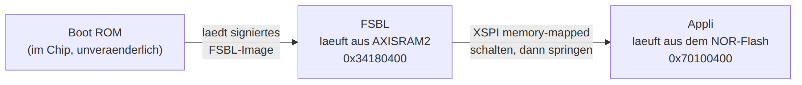
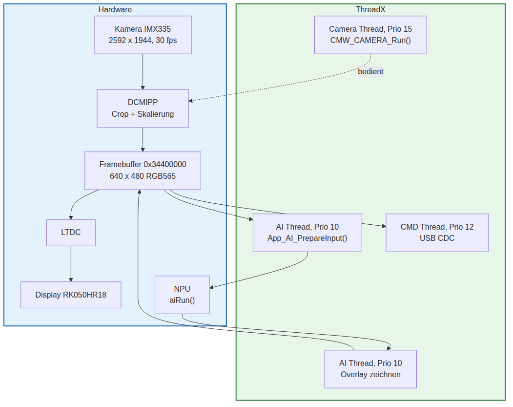

# Thesis_Robot_Pose: Firmware mit Edge-KI auf dem STM32N6570-DK

Das ist das Hauptskript, wenn die Schritte des KI-Trainings vollständig abgeeschlossen 
sind. Dabei inferiert das trainierte YOLO-Modell auf dem geraden vorhandenen Bild und es 
werden die entsprechende Bereiche markiert und die Winkel errechnet. 

Zwei Modelle sind gleichzeitig eingebunden und lassen sich per Tastendruck umschalten:
**Pose** (Keypoints des Roboterarms) und **Segmentierung** (Masken der fünf Armsektionen).

>[!IMPORTANT]
>Der Code konnte in der Vergangenheit erfolgreich geflsht werden, aber der STM32N6 startet nicht
>den Programmcode aus dem Flash. Ursache konnte nicht gefunden werden. 

---

## Inhalt

- [Thesis\_Robot\_Pose: Firmware mit Edge-KI auf dem STM32N6570-DK](#thesis_robot_pose-firmware-mit-edge-ki-auf-dem-stm32n6570-dk)
  - [Inhalt](#inhalt)
  - [1. Was man sieht, wenn es läuft](#1-was-man-sieht-wenn-es-läuft)
  - [2. Schnellstart](#2-schnellstart)
    - [Board vorbereiten](#board-vorbereiten)
    - [Der eine Befehl](#der-eine-befehl)
    - [Der Signier-Befehl im Klartext](#der-signier-befehl-im-klartext)
    - [Debuggen aus VS Code](#debuggen-aus-vs-code)
  - [3. Das Grundprinzip: zwei Programme](#3-das-grundprinzip-zwei-programme)
    - [Was der FSBL genau tut](#was-der-fsbl-genau-tut)
  - [4. Speicherlayout](#4-speicherlayout)
  - [5. Laufzeitarchitektur: die drei Threads](#5-laufzeitarchitektur-die-drei-threads)
    - [Der Weg durch main()](#der-weg-durch-main)
    - [Die drei Threads](#die-drei-threads)
    - [Camera Thread](#camera-thread)
    - [AI Thread](#ai-thread)
    - [Die Erweiterungspunkte (weak Hooks)](#die-erweiterungspunkte-weak-hooks)
  - [6. Der KI-Teil im Detail](#6-der-ki-teil-im-detail)
    - [Zwei Modelle nebeneinander](#zwei-modelle-nebeneinander)
    - [Ablauf einer Inferenz](#ablauf-einer-inferenz)
    - [Postprocessing](#postprocessing)
    - [NPU-Initialisierung](#npu-initialisierung)
  - [7. Bedienung am Board](#7-bedienung-am-board)
  - [8. USB-CDC-Protokoll](#8-usb-cdc-protokoll)
  - [9. Dateiübersicht](#9-dateiübersicht)
    - [Wo die Anwendungslogik liegt](#wo-die-anwendungslogik-liegt)
    - [Generiert und darf nicht verändert werden!](#generiert-und-darf-nicht-verändert-werden)
    - [Bootkette und Build](#bootkette-und-build)
  - [10. Troubleshooting](#10-troubleshooting)

---

## 1. Was man sieht, wenn es läuft

Nach dem Einschalten zeigt das Display das Live-Bild der Kamera in 640 x 480. Darüber
liegt die Ausgabe des aktiven Modells:

* **Pose-Modus:** die erkannten Keypoints als farbige Punkte
* **Segmentierungs-Modus:** die erkannten Masken als halbtransparente Farbflächen

Links oben sitzt ein kleiner Statusmarker. Blau bedeutet Pose, Grün bedeutet
Segmentierung. Ein rot blinkendes Feld daneben zeigt, dass gerade eine Inferenz läuft.
Zusätzlich blinkt LED1 (grün) bei jeder Inferenz, LED2 (rot) leuchtet im
Segmentierungs-Modus.

Der Taster **USER1 (B2)** schaltet zwischen den beiden Modellen um.

---

## 2. Schnellstart

### Board vorbereiten

BOOT0 und BOOT1 auf **Low** setzen. Das ist der Flash-Mode und die bevorzugte
Betriebsart.

### Der eine Befehl

Alles Weitere erledigt ein einziges Skript: bauen, signieren, flashen, zurücksetzen.

```bat
sign_binaries.bat
```

Was dabei nacheinander passiert:

```
1. cmake --preset Debug  +  cmake --build --preset Debug
2. objcopy: ELF zu BIN, für FSBL und Appli
3. Appli aufteilen:  -core.bin (ohne .rodata)  und  -rom2.bin (nur .rodata)
4. FSBL-BIN und Appli-Core-BIN signieren
5. signierte BINs zurück zu ELF wandeln, für den Debugger
6. Programmer erkennen (ST-Link, sonst J-Link)
7. drei Images in den externen Flash schreiben
8. Reset
```

### Der Signier-Befehl im Klartext

Der STM32N6 führt nur signierte Images aus. Der Aufruf lautet:

```bat
STM32_SigningTool_CLI.exe -bin <name>.bin -nk -of 0x80000000 -t fsbl -o <name>-trusted.bin -align -hv 2.3 -dump <name>-trusted.bin
```

### Debuggen aus VS Code

Die Konfiguration steht in `.vscode/launch.json` und nutzt den Debug-Typ
`stlinkgdbtarget`. Zwei Dinge sind daran STM32N6-spezifisch:

* `runEntry: "BOOT_Application"` statt eines normalen Reset-Vektors
* `imagesAndSymbols` trennt Symboldatei und geflashtes Image, weil das geflashte
  Image signiert ist und deshalb nicht mehr mit der ELF-Symboltabelle übereinstimmt
* `serverExtLoader` verweist auf `MX66UW1G45G_STM32N6570-DK.stldr`, den External
  Loader für den NOR-Flash

---

## 3. Das Grundprinzip: zwei Programme

Der STM32N6 hat **keinen internen Flash**. Der gesamte Code liegt in einem externen
NOR-Flash (MX66UW1G45G) und muss von dort erst zugänglich gemacht werden. Deshalb
besteht das Projekt aus zwei getrennten Programmen.



**FSBL** steht für First Stage Bootloader. Er ist klein, läuft aus dem internen RAM
und hat genau eine Aufgabe: die beiden XSPI-Schnittstellen in den Memory-Mapped-Modus
versetzen, damit die CPU Befehle direkt aus dem externen Flash holen kann
(Execute in Place). Danach springt er in die Appli.

**Appli** ist die eigentliche Anwendung: Kamera, Display, USB, ThreadX und die KI.

### Was der FSBL genau tut

```
SystemInit()
  └─ RCC-Reset von XSPI2 und XSPIM

FSBL_XSPI_Init()
  ├─ FSBL_NOR_PreReset()
  │    ├─ XSPI2 per RCC zwangsweise zuruecksetzen
  │    ├─ HAL_XSPI_Init  (Prescaler 3, also 37,5 MHz)
  │    ├─ HAL_XSPIM_Config (IO-Port 2, NCS1)
  │    ├─ Kommando 0x6699  (OPI DTR Reset Enable)
  │    ├─ Kommando 0x9966  (OPI DTR Reset Memory)
  │    └─ 15 ms warten     (tRST des Flash-Bausteins)
  │
  ├─ BSP_XSPI_NOR_Init(OPI_STR)
  ├─ BSP_XSPI_NOR_EnableMemoryMappedMode()
  ├─ BSP_XSPI_RAM_Init()
  └─ BSP_XSPI_RAM_EnableMemoryMappedMode()

JumpToApplication()
  ├─ Sanity Check der Vektortabelle
  ├─ __set_MSPLIM(0), I-Cache aus, HAL_SuspendTick()
  └─ Sprung nach 0x70100400
```

`FSBL_NOR_PreReset()` ist der interessanteste Teil und wird in Abschnitt 11 erklärt.

---

## 4. Speicherlayout

Der Linker teilt die Appli in zwei ROM-Bereiche auf. Der Grund ist Platz: die beiden
KI-Modelle bringen zusammen rund 5,9 MB an Gewichten mit, die nicht in einen einzelnen
511-KB-Bereich passen.

| Bereich | Größe | Inhalt | Flash-Adresse |
|---------|-------|--------|---------------|
| FSBL | klein | Bootloader | `0x70000000` |
| ROM | 511 KB, ca. 28 % belegt | `.text`, Anwendungscode, Runtime, ThreadX | `0x70100000` |
| ROM2 | 2047 KB, ca. 47 % belegt | `.rodata`, **Modellgewichte** beider Neuronalen Netzen | `0x70200400` |
| RAM | 2048 KB, ca. 0,5 % belegt | `.data`, `.bss`, Stacks | AXISRAM |

Linker-Skript: `Appli/STM32N657XX_ROMxspi1xspi2_RAMxspi3.ld`

Die Gewichte müssen **nicht** separat als Hex-Datei programmiert werden. Sie sind in
`network_ecblobs.h` als `static const uint64_t`-Arrays definiert, landen dadurch
automatisch in `.rodata` und damit in ROM2. Das Flash-Skript extrahiert diesen
Abschnitt mit `objcopy -j .rodata` in ein eigenes Binary und schreibt es an die
passende Adresse.

Zusätzlich liegen im internen RAM:

| Adresse | Inhalt |
|---------|--------|
| `0x34400000` | LCD-Framebuffer, 640 x 480 x 2 Byte RGB565, in AXISRAM3 |
| `0x34000000` | wird vom generierten KI-Code als Flex-Memory genutzt, **nicht** für eigene Puffer verwenden |

---

## 5. Laufzeitarchitektur: die drei Threads

### Der Weg durch main()

```c
MPU_Config();                    // muss VOR dem I-Cache kommen
SCB_EnableICache();              // nur I-Cache, D-Cache bleibt bewusst aus
HAL_Init();
SystemClock_Config();
__HAL_RCC_AXISRAM3_MEM_CLK_ENABLE();   // Takt für den Framebuffer
MX_GPIO_Init();
// ... GPDMA1, USART1, USB2, XSPI1, XSPI2, DCMIPP, LTDC, RAMCFG
SystemIsolation_Config();
STM32CubeAI_Studio_AI_Init();    // NPU und beide Netze initialisieren
MX_ThreadX_Init();               // tx_kernel_enter, kehrt nie zurueck
```

**Die MPU wird vor dem I-Cache konfiguriert.** Der Cache beginnt sofort, Befehlszeilen
aus dem XSPI-Bereich zu holen. Stimmen die Speicherattribute zu diesem Zeitpunkt
nicht, holt er sie mit den falschen Eigenschaften.

**Der D-Cache bleibt absichtlich aus.** Kamera und DMA schreiben direkt in den
Framebuffer, ohne Cache-Maintenance. Mit aktiviertem D-Cache gab es Hard Faults und
korrupte Bilddaten. In `app_config.h` steht zwar `USE_MCU_DCACHE 1`, aber `main.c`
aktiviert nur `SCB_EnableICache()`.

### Die drei Threads

Nach `tx_kernel_enter()` übernimmt der ThreadX-Scheduler. Bei ThreadX gilt: **kleinere
Zahl bedeutet höhere Priorität.**

| Thread | Priorität | Stack | Aufgabe |
|--------|-----------|-------|---------|
| AI Thread | 10 (höchste) | 4 KB | Inferenz und Overlay |
| CMD Thread | 12 | 4 KB | USB-CDC-Kommandos, Bildtransfer |
| Camera Thread | 15 (niedrigste) | 8 KB | Kamera-Pipeline bedienen |

Alle drei laufen als Endlosschleife mit `tx_thread_sleep(1)` am Ende, geben also nach
jedem Durchlauf einen Tick ab. Dadurch blockiert keiner die anderen.



Der Framebuffer ist der zentrale Treffpunkt: die Kamera schreibt hinein, der LTDC
zeigt ihn an, der AI-Thread liest daraus seinen Eingang und zeichnet sein Ergebnis in
denselben Puffer zurück.

### Camera Thread

```
CMW_CAMERA_GetSensorName()
CMW_CAMERA_Init()               2592 x 1944, 30 fps, gespiegelt
HAL_DCMIPP_SetIPPlugConfig()    Burst 128 Byte, Page 256 Byte, Client 5
CMW_CAMERA_SetPipeConfig()      PIPE1 zu 640 x 480 RGB565, Aspect-Ratio-Crop
CMW_CAMERA_Start(PIPE1, LCD_FB_ADDRESS, CONTINUOUS)

200 Ticks ISP-Warmup            Belichtung und Weissabgleich einschwingen lassen
while(1) { CMW_CAMERA_Run(); tx_thread_sleep(1); }
```

Der ISP braucht die Aufwärmphase, sonst sind die ersten Bilder über- oder
unterbelichtet. Nach dem Warmup läuft die Kamera dauerhaft weiter, damit die KI
kontinuierlich ein aktuelles Bild bekommt.

### AI Thread

Der gesamte AI-Prozess lässt sich in diesen Zeilen kombrimieren: 

```c
for (;;)
{
  App_AI_SetModel(App_AI_GetRequestedModel());   // Taster auswerten

  if (App_AI_PrepareInput(App_AI_GetInputBuffer(),
                          App_AI_GetInputSize()) == 0)
  {
    if (aiRun() == 0)
      App_AI_RenderActiveModelOverlay();          // ins Display zeichnen

    App_AI_OnOutputs(outputs, sizes, count);      // Hooks fuer eigene Logik
    App_AI_OnResult(outputs[0], sizes[0]);
  }
  tx_thread_sleep(1);
}
```

### Die Erweiterungspunkte (weak Hooks)

Der KI-Code kennt weder Kamera noch Display. Die Verbindung entsteht über Funktionen,
die als `__weak` deklariert sind und projektspezifisch überschrieben werden. 

| Hook | Aufgabe | Standardverhalten |
|------|---------|-------------------|
| `App_AI_PrepareInput()` | Modelleingang füllen | liest den Framebuffer, siehe unten |
| `App_AI_OnResult()` | ein Ergebnis verarbeiten | leer |
| `App_AI_OnOutputs()` | alle Ausgänge verarbeiten | leer |
| `App_AI_GetRequestedModel()` | gewünschtes Modell melden | fragt den Taster ab |
| `App_AI_GetDisplayFramebuffer()` | Ziel für das Overlay | `NULL` im KI-Modul, in `app_threadx.c` auf `0x34400000` überschrieben |

Dass der Framebuffer-Hook im KI-Modul standardmäßig `NULL` liefert, ist eine
Sicherheitsmaßnahme: `0x34000000` wird häufig vom generierten Flex-Memory belegt, und
ein falsch gesetzter Framebuffer würde dort die KI-Puffer überschreiben.

**Die Standard-Implementierung von `App_AI_PrepareInput()`** rechnet den Framebuffer in
den Modelleingang um: RGB565 zu RGB888, Nearest-Neighbor-Skalierung auf die Kantenlänge,
die sich aus der Puffergröße ergibt (`input_size / 3`, davon die Wurzel). Passt die
Größe nicht zu einem Quadrat, füllt sie ersatzweise ein laufendes Testmuster ein.
So bleibt sichtbare Aktivität erhalten, auch wenn die Kamera noch nicht liefert.

---

## 6. Der KI-Teil im Detail

Zuständig ist `Appli/AI/App/app_x-cube-ai.c`, mit rund 1000 Zeilen die inhaltlich
dichteste Datei des Projekts.

### Zwei Modelle nebeneinander

```c
LL_ATON_DECLARE_NAMED_NN_INSTANCE_AND_INTERFACE(pose)
LL_ATON_DECLARE_NAMED_NN_INSTANCE_AND_INTERFACE(seg)
```

Beide Netze sind fest einkompiliert und liegen gleichzeitig im Flash. Umgeschaltet
wird nicht das Programm, sondern nur ein Zeiger.

```c
typedef struct {
  NN_Instance_TypeDef *instance;   // das Netz selbst
  uint8_t *input;                  // Eingangspuffer
  uint8_t *outputs[2];             // Ausgangspuffer
  size_t   input_size;
  size_t   output_sizes[2];
  uint32_t output_count;           // Pose: 1, Segmentierung: 2
} AppAIModelCtx_t;
```

`aiInit()` initialisiert die Runtime, beide Netze und beide Kontexte. Die Puffer-Adressen
holt es sich zur Laufzeit vom Runtime über `LL_ATON_Input_Buffers_Info()` und
`LL_ATON_Output_Buffers_Info()`.

`App_AI_SetModel()` setzt lediglich `g_active_model` und aktualisiert die
Puffer-Zeiger.

### Ablauf einer Inferenz

Die NPU arbeitet ein Netz nicht in einem Durchlauf ab, sondern in sogenannten
Epoch-Blöcken. `aiRun()` betreibt folgende Schleife:

```c
LL_ATON_RT_Reset_Network(ctx->instance);
do {
  ret = LL_ATON_RT_RunEpochBlock(ctx->instance);
  if (ret == LL_ATON_RT_WFE) {
      tx_thread_sleep(1);      // unter ThreadX: Tick abgeben statt WFE
      if (++wfe_guard > 4000) return -2;
  }
  if (++guard > 2000000) return -1;
} while (ret != LL_ATON_RT_DONE);
```

`WFE` heißt Wait For Event: die NPU rechnet, die CPU hat nichts zu tun. In einem
Bare-Metal-Programm würde hier `LL_ATON_OSAL_WFE()` stehen und die CPU schlafen legen.
Unter ThreadX wäre das gefährlich, denn bleibt der NPU-Interrupt aus, hängt der Thread
für immer. Deshalb wird stattdessen ein Tick abgegeben und gepollt, mit zwei Zählern
als Zwangsabbruch.

| Rückgabewert | Bedeutung |
|--------------|-----------|
| `0` | Inferenz erfolgreich |
| `-1` | Gesamt-Guard ausgelöst, 2.000.000 Durchläufe |
| `-2` | WFE-Guard ausgelöst, 4000 Ticks ohne Fortschritt, fehlender NPU-Interrupt |

Abfragen lässt sich der letzte Status über `App_AI_GetLastRunStatus()`, die Anzahl der
gelaufenen Inferenzen über `App_AI_GetRunCounter()`.

### Postprocessing

Das Modell liefert rohe int8-Tensoren. Die Umwandlung in Boxen, Masken und Keypoints
passiert vollständig auf der CPU des STM32N6.

**Die Formaterkennung ist adaptiv.** `App_AI_InferYoloSegParams()` bekommt nur die
beiden Puffergrößen und rät daraus die Geometrie: es probiert Masken-Kantenlängen aus
der Liste 160, 128, 96, 80, 64, 48, 40, 32 durch und prüft, ob die Maskengröße glatt
aufgeht. Danach testet es Box-Anzahlen aus 8400, 5376, 25200, 1344, 1008, 768 gegen
die Detektionsgröße und leitet die Klassenzahl aus dem Rest ab. 

**Danach die übliche YOLO-Kette:**

```
DecodeYoloSegDetections()   Boxen mit Konfidenz oberhalb der Schwelle sammeln
                            Schwelle: conf_threshold_raw = 40 (int8, roh)
NmsDetections()             Ueberlappende Boxen per IoU zusammenfassen
DrawYoloSegOverlay()        Maskenprototypen mit den Koeffizienten verrechnen
                            und halbtransparent in den Framebuffer mischen
```

Die Farbmischung übernimmt `App_AI_ColorBlend565()`, das direkt im RGB565-Format
rechnet, ohne Umweg über RGB888.

**Bei Pose** versucht `App_AI_DrawPoseKeypointsYolo()` zuerst, den Ausgang als
YOLO-Pose-Tensor zu lesen. Passt das Format nicht, greift
`App_AI_DrawPoseKeypointsHeatmap()` als Rückfallebene, die den Ausgang als Heatmap
interpretiert und deren Maxima als Keypoints zeichnet.

### NPU-Initialisierung

In `npu_init.c` passieren vier Dinge, bevor überhaupt ein Netz laufen kann:

| Funktion | Aufgabe |
|----------|---------|
| `NPU_Config()` | NPU-Takt einschalten, Force- und Release-Reset, optional NPU-Cache |
| `RISAF_Config()` | die Speicher-Firewall so öffnen, dass die NPU auf die Puffer zugreifen darf |
| `Set_CLK_Sleep_Mode()` | Taktverhalten im Schlafmodus festlegen |
| `aiPreInitialize()` | Sammelaufruf, wird vor `aiInit()` ausgeführt |

RISAF ist der Speicherschutz des STM32N6. Ohne passende Konfiguration darf die NPU
nicht auf die Puffer im RAM zugreifen.

In `app_config.h` steht `USE_OVERDRIVE 1`. Das bedeutet CPU mit 800 MHz und NPU mit
1 GHz. Standardwerte sind 600 MHz und 800 MHz.

---

## 7. Bedienung am Board

| Element | Funktion |
|---------|----------|
| Taster USER1 (B2) | schaltet zwischen Pose und Segmentierung um, entprellt über 200 Ticks |
| LED1 grün | blinkt bei jeder Inferenz |
| LED2 rot | aus = Pose, an = Segmentierung |
| Statusmarker links oben | blau = Pose, grün = Segmentierung |
| rotes Blinkfeld daneben | Inferenz läuft |
| RESET | Neustart, falls die Anwendung nach dem Flashen nicht selbst startet |

Debug-Ausgaben laufen über **USART1** und erscheinen auf dem virtuellen COM-Port des
ST-Link. Das ist ein anderer Port als der USB-CDC-Port der Appli. Die Hilfsfunktionen
dafür heißen `dbg()` und `dbg_val()` in `app_threadx.c`.

---

## 8. USB-CDC-Protokoll

Dieses Feature, wurde ursprünglich dafür vorgesehen, dass das Display Overlay auch auf einem 
externen Display angezeigt werden kann und damit nicht abhängig wäre auf dem bereits installierten 
LCD. Umsetztung wurde nicht getestet. 

| Kommando | Antwort |
|----------|---------|
| `PING` | `PONG` |
| `TEST` | mehrere Test-Transfers |
| `CAPTURE` | ein komplettes Bild |

Nach der Enumeration sendet das Board dreimal `READY` als Lebenszeichen.

**Bildübertragung:**

```
Header:   "IMG:" (4 Byte)  +  Payload-Länge (4 Byte)
Payload:  640 * 480 * 2 = 768000 Byte, RGB565 roh
```

Puffergrößen: 64 Byte für Empfang, 8192 Byte für Senden, passend zu
`UX_SLAVE_REQUEST_DATA_MAX_LENGTH`. Ein Transfer bricht nach 10 Sekunden ab,
fehlgeschlagene Blöcke werden bis zu fünfmal wiederholt.

---

## 9. Dateiübersicht

### Wo die Anwendungslogik liegt

| Datei | Inhalt |
|-------|--------|
| `Appli/Core/Src/main.c` | Peripherie-Initialisierung, Takt, MPU, LTDC, DCMIPP |
| `Appli/Core/Src/app_threadx.c` | die drei Threads, Hook-Implementierungen, USB-Protokoll |
| `Appli/AI/App/app_x-cube-ai.c` | Modellverwaltung, Inferenzschleife, Postprocessing, Overlay |
| `Appli/AI/App/app_x-cube-ai.h` | die öffentliche Schnittstelle des KI-Moduls |
| `Appli/AI/App/npu_init.c` | NPU-Takt, RISAF, Cache |
| `Appli/AI/App/app_config.h` | Cache- und Overdrive-Schalter |

### Generiert und darf nicht verändert werden!

| Ort | Inhalt |
|-----|--------|
| `Appli/AI/generated/` | Netzwerkcode aus STM32Cube AI Studio |
| `Appli/AI/models/pose/`, `.../seg/` | die beiden Modell-Exporte |
| `Middlewares/ST/AI/` | ST AI Runtime und NPU Low-Level-Runtime |
| `Drivers/` | HAL und BSP |

### Bootkette und Build

| Datei | Inhalt |
|-------|--------|
| `FSBL/Core/Src/main.c` | `JumpToApplication()`, `FSBL_NOR_PreReset()`, `FSBL_XSPI_Init()` |
| `FSBL/Core/Src/stm32n6xx_hal_msp.c` | XSPI2-Taktquelle |
| `Appli/Core/Src/tx_initialize_low_level.S` | ThreadX-Startup und SysTick-Handler |
| `Appli/STM32N657XX_ROMxspi1xspi2_RAMxspi3.ld` | Linker-Skript mit ROM und ROM2 |
| `CMakeLists.txt`, `CMakePresets.json`, `mx-generated.cmake` | Build |
| `Appli/ai-integration.cmake` | KI-Quellen, Include-Pfade, LL_ATON-Defines, Runtime-Library |
| `sign_binaries.bat` | bauen, signieren, flashen |

Die KI-Integration ist bewusst von den CubeMX-generierten CMake-Dateien getrennt.
Läuft der Code-Generator erneut, überschreibt er `mx-generated.cmake`, aber nicht
`ai-integration.cmake`.

---

## 10. Troubleshooting

| Symptom | Ursache und Abhilfe |
|---------|---------------------|
| Board startet nach dem Flashen nicht | RESET drücken. Der automatische Reset am Ende des Skripts darf fehlschlagen, ohne dass das Programmieren ungültig ist |
| HardFault sehr früh in `main()` | ROM2 wurde nicht geflasht. Ausgabe des Flash-Skripts prüfen. |
| Display bleibt schwarz | AXISRAM3-Takt nicht aktiviert, oder `LCD_FB_ADDRESS` in `main.c` und `app_threadx.c` stimmen nicht überein. Beide Dateien definieren die Adresse getrennt |
| Bild steht, aber kein Overlay | `App_AI_GetDisplayFramebuffer()` liefert `NULL`. Die Überschreibung in `app_threadx.c` muss aktiv sein |
| `aiRun()` liefert dauerhaft `-2` | NPU-Interrupt kommt nicht an. RISAF-Konfiguration und NPU-Takt in `npu_init.c` prüfen |
| Overlay zeichnet Unsinn | Die Formaterkennung hat die Tensorgeometrie falsch geraten. Ausgangsgrößen des Modells gegen `App_AI_InferYoloSegParams()` prüfen |
| Flash-Skript findet keinen Programmer | Nur der ST-Link-Zweig ist funktionsfähig. |
| Signierung schlägt fehl | Pfad `CUBE_PROGRAMMER_PATH` im Skript prüfen. Das Ergebnis steht oben in der Ausgabe. |
| Debugger zeigt `??@<hex> Unknown Source` | In `launch.json` im stlink-Abschnitt `"serverApID": "1"` ergänzen |
| Bilder über USB kommen unvollständig | `XFER_TIMEOUT_SEC` erhöhen, anderes USB-Kabel probieren |